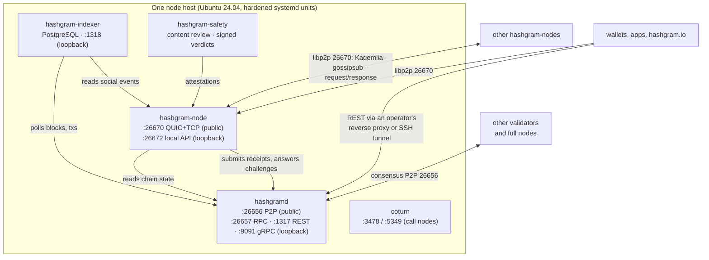
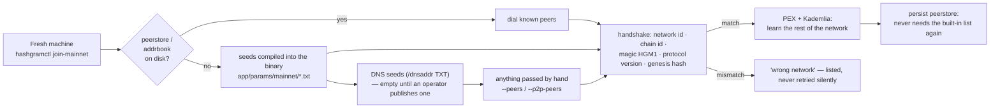
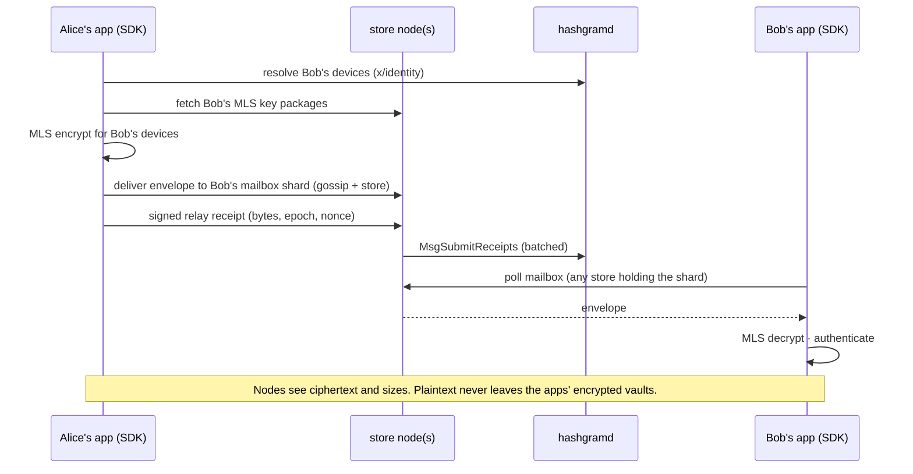
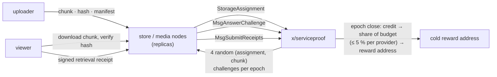
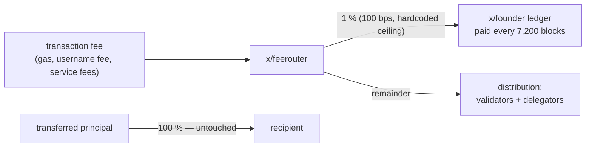
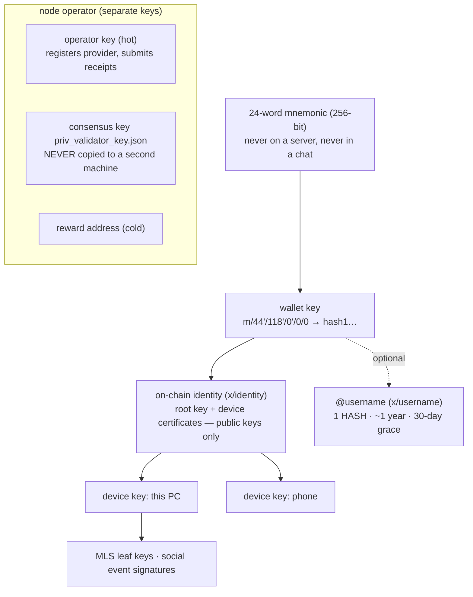
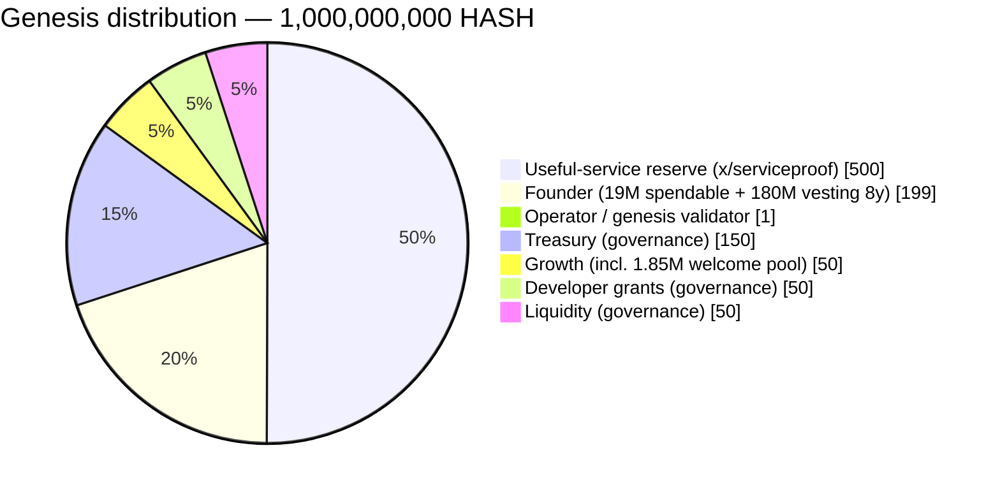

# Hashgram

**A Layer-1 network with a fixed supply, a finite reward reserve, end-to-end
encrypted messaging, a signed social layer, and no central point of control.**

[](https://github.com/deepdrogo/hashgram/actions/workflows/ci.yml)
[](LICENSE)
[](#mainnet-at-a-glance)

Hashgram Core is one repository: the blockchain (Go, Cosmos SDK v0.53 /
CometBFT v0.38), the peer-to-peer node (Rust, libp2p), the client SDK (Rust),
the indexer and safety engine (Go), the operator tooling, and the genesis
that launched Mainnet on **2026-09-10**. Everything a node runs is here.
Everything a client needs is here. Nothing is hidden behind a service.

---

## Mainnet at a glance

| | |
| --- | --- |
| Chain id | `hashgram-1` |
| Launched | 2026-09-10 13:01:34 UTC |
| Genesis SHA-256 | `e322bc2319f6e0173286fa526dab5a8ff8ad0797c7b80dd03e7c9d98621d5e4d` — compiled into the binaries ([`app/params/mainnet.go`](app/params/mainnet.go), [`node/hashgram-net/src/mainnet.rs`](node/hashgram-net/src/mainnet.rs)) |
| Supply | 1,000,000,000 HASH, fixed. `1 HASH = 1,000,000 uhash`. No mint module. |
| Block time | ~4 s |
| Bech32 prefix / coin type | `hash` / 118 |
| Founder share | 1 % of **protocol fee revenue** (never of transfers), ceiling hardcoded |
| Seed nodes | [`app/params/mainnet/`](app/params/mainnet/) — shared by Go and Rust builds |
| Join | `hashgramctl join-mainnet` — no arguments: genesis, hash and seeds are built in |

Like Bitcoin, the software you choose to run is the out-of-band source of
truth for the genesis. A node whose handshake reports a different genesis
hash is "wrong network", not a peer.

---

## What Hashgram is

```mermaid
flowchart LR
  subgraph Chain["Layer 1 — hashgramd (Go)"]
    direction TB
    C1[CometBFT consensus]
    C2[bank · staking · gov · vesting]
    C3[x/founder · x/feerouter · x/treasury]
    C4[x/identity · x/username]
    C5[x/serviceproof · x/welcome · x/network]
  end

  subgraph P2P["Off-chain network — hashgram-node (Rust, libp2p)"]
    direction TB
    N1[Genesis-checking handshake]
    N2[MLS mailboxes · store-and-forward]
    N3[Signed social events · gossip]
    N4[Content-addressed media · storage challenges]
    N5[Call discovery · TURN / SFU]
    N6[Rewards agent · receipts]
  end

  subgraph Clients["Clients — hashgram-sdk (Rust)"]
    direction TB
    S1[Vault · 24-word keys]
    S2[Wallet · staking · usernames]
    S3[Messaging · feed · reels · calls]
  end

  Clients -- "REST / RPC (chain reads, tx broadcast)" --> Chain
  Clients -- "QUIC / TCP 26670" --> P2P
  P2P -- "receipts, challenges, registrations" --> Chain
  Chain -- "identities, devices, names, params" --> P2P
```



Three ideas hold it together:

1. **The chain decides who owns what** — coins, identities, device keys,
   names, bonds — and settles rewards. It is small and boring on purpose.
2. **The node network moves bytes** — encrypted messages, public posts,
   media, calls — and is paid for it from a finite reserve, on evidence the
   served client signed.
3. **The client trusts nobody for content.** Every blob is hash-checked,
   every social event signature-checked against on-chain devices, every
   message authenticated by MLS. Nodes are interchangeable providers of
   availability.

---

## What is different about it

Most of these are claims any chain can make. Each one links to the code that
enforces it and the test that proves it.

**There is no inflation, and not because a parameter is set to zero.** The
`x/mint` module is not wired into the application at all. A parameter can be
changed by a proposal; a module that is absent requires a new binary the
validator set has to adopt. Every uhash that will ever exist was created in
the genesis block.
[`app/app.go`](app/app.go) · [`app/app_test.go`](app/app_test.go) asserts no
module holds the minter permission.

**The Founder's 1 % is a share of protocol fee revenue, never a tax on
transfers.** Send 100 HASH, the recipient gets exactly 100 HASH. The share
applies to fees the protocol already collected, and is capped at 100 basis
points by a compile-time constant governance cannot raise.
[`x/founder`](x/founder) · [`x/feerouter`](x/feerouter) ·
[`x/feerouter/keeper/route_test.go`](x/feerouter/keeper/route_test.go)

**Rewards for useful work, not for wasted electricity.** There is no mining.
Storage providers are paid on bytes the network assigned to them and
challenges they answered. Relay and call providers are paid on receipts the
served client signed. Self-reported traffic earns nothing; a pair of nodes
trading fake receipts is discounted to 20 % of what they claim.
[`x/serviceproof`](x/serviceproof) · [docs/SERVICE_REWARDS.md](docs/SERVICE_REWARDS.md)

**The reward reserve is finite and cannot be topped up.** 500,000,000 HASH at
genesis, spent on a declining schedule that takes a fixed fraction of what
remains each epoch. It asymptotes rather than hitting a cliff.
[`x/serviceproof/types/emission.go`](x/serviceproof/types/emission.go)

**A fork of this software is a different network, and the code says so.**
Network identity is five parts: name, network id, chain id, genesis hash and a
four-byte magic. Signatures are domain-separated by network, so nothing signed
on one Hashgram network replays on another.
[`x/network`](x/network) · [`app/params/network.go`](app/params/network.go) ·
[`node/hashgram-net`](node/hashgram-net)

**Accounts are keys.** There is no sign-up service, e-mail or password
database. An account is a 24-word mnemonic; people are found by public key,
and optionally by an `@username` registered on chain.
[`node/hashgram-chain/src/wallet.rs`](node/hashgram-chain/src/wallet.rs) ·
[`x/username`](x/username) · [`x/identity`](x/identity)

**No master key, no kill switch, no override.** No administrative transaction
can freeze an account, reverse a transfer, mint a coin or change the supply.
Treasury spending requires a governance proposal and leaves a record.
[docs/DECENTRALIZATION.md](docs/DECENTRALIZATION.md) is an honest account of
where control still sits today.

---

## Architecture

### Components and how they talk



Administrative interfaces bind to loopback. `hashgramctl mainnet-preflight`
refuses to start a Mainnet node whose RPC is reachable from outside.

### How a new node finds the network



The same five layers Bitcoin uses (peers.dat, fixed seeds, DNS seeds,
`-addnode`, `addr` gossip). A blocked or hijacked seed can withhold peers from
a brand-new node; it can never route it onto a different chain, because the
genesis hash is pinned in the binary and verified on every handshake.

### A message, end to end



### Media and storage rewards



### Where a fee goes



### Keys



---

## The chain

Eight custom modules on top of the standard Cosmos SDK set.

| Module | What it does |
| --- | --- |
| [`x/network`](x/network) | Network identity, genesis hash pinning, signature domain separation |
| [`x/founder`](x/founder) | The Founder revenue ledger and its compile-time fee ceiling |
| [`x/feerouter`](x/feerouter) | Splits protocol fee revenue; never touches transferred principal |
| [`x/welcome`](x/welcome) | Tiered joining reward, 50/5/1/0 HASH, capped at 1,850,000 HASH; off until an attestor exists |
| [`x/serviceproof`](x/serviceproof) | Proof of Useful Service: receipts, storage challenges, bonds, fraud scoring, epoch settlement |
| [`x/username`](x/username) | `@name` registry with confusable-character defence and reserved names |
| [`x/identity`](x/identity) | Root identities, device certificates, social recovery with delay. Public keys only. |
| [`x/treasury`](x/treasury) | Named genesis allocations (treasury, growth, dev grants, liquidity), spendable only by governance |

Standard: `auth`, `bank`, `staking`, `slashing`, `distribution`, `gov`,
`evidence`, `vesting`, `upgrade`, `consensus`, `genutil`, `feegrant`,
`authz`. **Excluded on purpose:** `x/mint`, `x/circuit`.

Governance today: voting period 7 days, quorum 40 %, threshold 50 %, veto
33.4 %; unbonding 21 days; slashing 5 % double-sign, 0.01 % downtime.

---

## Tokenomics



**Emission from the reserve**, per epoch of 21,600 blocks (≈ 1 day):

```text
budget = min( floor(remaining × 5 / 10,000), 250,000 HASH )
```

| After | Paid out (max) | Remaining |
| --- | --- | --- |
| 1 year | ≈ 83.4 M (16.7 %) | ≈ 416.6 M |
| 5 years | ≈ 299.3 M (59.9 %) | ≈ 200.7 M |
| 10 years | ≈ 419.4 M (83.9 %) | ≈ 80.6 M |

The budget is a **ceiling**: a single provider can take at most 5 % of an
epoch (12,500 HASH/day today), unpaid budget stays in the reserve, and credit
comes only from real bytes stored and served. Registration bond 1,000 HASH;
fraud → 5 % slash and jail. Everything: [docs/TOKENOMICS.md](docs/TOKENOMICS.md).

---

## Node roles

| Role | Binary | Does | Earns |
| --- | --- | --- | --- |
| `validator` | `hashgramd` | Signs blocks | block fees, staking rewards |
| `relay` | `hashgram-node` | Forwards encrypted envelopes and gossip; circuit relay for NAT'd peers | relay receipts |
| `store` | `hashgram-node` | Holds mailboxes, key packages, blobs; answers storage challenges | storage assignments × challenges, retrieval receipts |
| `media` | `hashgram-node` | Serves media manifests and chunks | retrieval receipts |
| `bootstrap` | `hashgram-node` | Helps new nodes find peers | relay receipts |
| `call` | `hashgram-node` + coturn (+ LiveKit) | TURN credentials, call announcements, optional SFU | call receipts |
| `indexer` | `hashgram-indexer` | PostgreSQL view of chain and public social data | — (operator service) |
| `safety` | `hashgram-safety` | Reviews public content, signs verdicts | — (operator service) |

Details and hardware guidance: [docs/NODE_ROLES.md](docs/NODE_ROLES.md).

---

## Quick start

### Run a node and join Mainnet

Ubuntu Server 24.04, a public IPv4, ports 26656 and 26670 (TCP+UDP) open.

```bash
git clone https://github.com/deepdrogo/hashgram && cd hashgram
sudo scripts/install/bootstrap-ubuntu.sh        # users, dirs, firewall, PostgreSQL (loopback), binaries, units

hashgramctl init --moniker <your-name>
hashgramctl join-mainnet                        # genesis, hash and seeds are compiled in
hashgramctl network-info                        # pin must read e322bc23…5e4d
hashgramctl configure-role relay,store,media \
  --declared-storage 500000000000 \
  --reward-address hash1<a cold address you wrote down>
hashgramctl start
hashgramctl chain-status                        # wait for catching_up = false
```

To earn, fund the operator address printed by `configure-role` with
≥ 1,000 HASH (bond) plus fees and set `auto_register_provider = true` in
`/etc/hashgram/node.toml`; `hashgramctl rewards <operator>` shows credit and
payouts. To become a validator: [docs/MAINNET.md](docs/MAINNET.md). Never
copy `priv_validator_key.json` between machines.

### Build from source

Go 1.26.x, Rust ≥ 1.90 (protobuf is compiled with pure-Rust `protox`; no
`protoc` needed).

```bash
make build            # Go binaries into build/
make rust-release     # hashgram-node, hashgram-client into build/
make test             # go test -race
make rust-test
make ci               # lint, gosec, gitleaks, govulncheck, tests — what CI runs
```

### Local devnet with acceptance checks

```bash
scripts/testnet/devnet.sh            # genesis → chain → asserts the claims above against it
scripts/testnet/four-validator.sh    # four validators, a killed validator, fork isolation
scripts/testnet/phase2.sh            # 63 network-level checks: messaging, media, social, rewards
```

### Talk to Mainnet from a laptop, with no address typed

```bash
export HASHGRAM_PASSPHRASE=throwaway
hashgram-client configure --network mainnet \
  --genesis-hash e322bc2319f6e0173286fa526dab5a8ff8ad0797c7b80dd03e7c9d98621d5e4d
hashgram-client net peers            # finds nodes through the compiled-in seed list
```

---

## Repository map

```text
app/            Cosmos SDK application wiring, params, upgrades
app/params/mainnet/   genesis.json · seeds.txt · bootstrap_peers.txt · dns_seeds.txt (shared by Go and Rust)
x/              the eight custom modules
cmd/            hashgramd · hashgramctl · hashgram-keygen · hashgram-indexer · hashgram-safety · hashgram-test-client
proto/          protobuf: chain modules and the P2P wire protocol (one source for Go and Rust)
genesis/        genesis construction and the launch-allocation tests
indexer/        PostgreSQL indexer and its read API
safety/         the safety engine (public content review, signed attestations)
node/           Rust workspace
  hashgram-net/       network identity, canonical signing, handshake
  hashgram-proto/     wire protocol types (protox-compiled)
  hashgram-p2p/       libp2p swarm: Kademlia, gossipsub, request/response, peerstore, limits
  hashgram-mls/       MLS groups
  hashgram-identity/  Argon2id vault, root/device keys
  hashgram-chain/     wallet (24 words), signing, REST client
  hashgram-node/      the daemon: mailboxes, blobs, social log, safety table, rewards agent, local API
  hashgram-client/    reference CLI exercising every SDK call
  testdata/           signing vectors (90) generated from Go — cross-language contract
  fuzz/               fuzz targets
sdk/rust/hashgram-sdk/   the client SDK: account · link · messaging · social · blob · calls
deploy/         hardened systemd units, Prometheus rules, Grafana dashboards
scripts/        install/ · launch/ · testnet/ · dev/ (check-docs.sh keeps docs honest)
docs/           written from the code; says "not built" where it is not
tools/          tokenomics simulator, signing-vector generator
```

---

## Clients

The SDK is Rust and has no UI. Native applications are specified, not yet
built; each specification is a complete, copy-paste build prompt that names
only endpoints and messages that exist (`scripts/dev/check-docs.sh` fails
otherwise):

| | |
| --- | --- |
| Windows — full app: wallet, messenger, feed, reels, calls, "Earn" with a bundled node | [docs/PROMPT_DESKTOP_AI.md](docs/PROMPT_DESKTOP_AI.md) (Tauri 2 + Rust + SDK) |
| Windows screens specification | [docs/PROMPT_WINDOWS_DESKTOP.md](docs/PROMPT_WINDOWS_DESKTOP.md) |
| iOS / Android — what differs | [docs/PROMPT_IOS_APP.md](docs/PROMPT_IOS_APP.md) · [docs/PROMPT_ANDROID_APP.md](docs/PROMPT_ANDROID_APP.md) |
| hashgram.io — live explorer, network dashboard, documentation; runs on its own full node | [docs/PROMPT_HASHGRAM_IO.md](docs/PROMPT_HASHGRAM_IO.md) |
| Every interface a client may rely on, and what does not exist | [docs/CLIENT_CONNECTIVITY_SPEC.md](docs/CLIENT_CONNECTIVITY_SPEC.md) |

---

## Status — honest

| Component | State |
| --- | --- |
| Mainnet `hashgram-1` | **Live since 2026-09-10.** One genesis validator; more are needed — a BFT network needs > ⅔ of voting power online, so with equal stake, four validators is the first configuration that survives losing one. |
| Blockchain, eight modules, genesis tooling | Complete, tested, running |
| `hashgram-node`, `hashgram-sdk`, `hashgram-client` | Complete; 63 network-level acceptance checks pass |
| `hashgram-indexer`, `hashgram-safety` | Complete |
| Discovery | Seeds compiled in; `join-mainnet` needs no arguments. One seed operator today; DNS seed list empty until an operator publishes a name |
| Reproducible release build, CI (tests, staticcheck, gosec, gitleaks, govulncheck, cargo audit, fuzz) | Green |
| Useful-service rewards | Live: reserve funded, first provider registered; storage assigner pending governance proposal #1 |
| Welcome rewards | Disabled until an attestor is registered (by design) |
| Chain reads over libp2p for light clients | Not built — wallets read the chain over REST today (as every Cosmos wallet does). Specified as Stage 0 of the Windows prompt |
| Windows / iOS / Android apps, hashgram.io | Not built; prompts above |
| Push notifications, SFU group-call E2EE, token bridge | Not built |

---

## Security

- **Report vulnerabilities privately** — use GitHub's *Report a vulnerability*
  on this repository, not a public issue. Consensus bugs disclosed before a
  patch are bugs being exploited. Policy: [docs/SECURITY.md](docs/SECURITY.md).
- Threat model: [docs/THREAT_MODEL.md](docs/THREAT_MODEL.md). Logging rules
  (no full IPs, no content): [docs/LOGGING_POLICY.md](docs/LOGGING_POLICY.md).
- Nothing in this repository is a secret. Keys, mnemonics and node identities
  are generated on the machines that use them and are git-ignored; the
  history has been scanned for them and CI runs `gitleaks`.

---

## Documentation

Written from the code, not from intent. Where something is not implemented,
the document says so rather than describing it in the present tense.

**Start here** — [ARCHITECTURE.md](docs/ARCHITECTURE.md) · [TOKENOMICS.md](docs/TOKENOMICS.md) · [OPERATIONS.md](docs/OPERATIONS.md)

**Running a node** — [NODE_ROLES.md](docs/NODE_ROLES.md) · [MAINNET.md](docs/MAINNET.md) · [DISASTER_RECOVERY.md](docs/DISASTER_RECOVERY.md) · [SERVICE_REWARDS.md](docs/SERVICE_REWARDS.md)

**Security and governance** — [SECURITY.md](docs/SECURITY.md) · [THREAT_MODEL.md](docs/THREAT_MODEL.md) · [DECENTRALIZATION.md](docs/DECENTRALIZATION.md) · [LOGGING_POLICY.md](docs/LOGGING_POLICY.md)

**Protocol** — [PROTOCOL.md](docs/PROTOCOL.md) · [MESSAGING.md](docs/MESSAGING.md) · [SOCIAL_PROTOCOL.md](docs/SOCIAL_PROTOCOL.md) · [STORAGE.md](docs/STORAGE.md) · [CALLS.md](docs/CALLS.md) · [MODERATION.md](docs/MODERATION.md) · [CLIENT_CONNECTIVITY_SPEC.md](docs/CLIENT_CONNECTIVITY_SPEC.md)

**Launch record** — [FOUNDER_LAUNCH_RUNBOOK.md](docs/FOUNDER_LAUNCH_RUNBOOK.md) · [LAUNCH_HANDOVER_KA.md](docs/LAUNCH_HANDOVER_KA.md) (Georgian) · [OWNER_LAUNCH_KA.md](docs/OWNER_LAUNCH_KA.md) (Georgian) · [FINAL_REPORT.md](docs/FINAL_REPORT.md) · [PHASE1_REPORT.md](docs/PHASE1_REPORT.md)

---

## Contributing

- Run `make ci` and `scripts/dev/check-docs.sh` before opening a pull request;
  CI runs the same.
- Protocol changes need a protobuf change under `proto/`, regenerated Go and
  Rust, a signing vector if a signed object changed, and a docs update in the
  same PR.
- Operators who run a stable public node may add it to
  [`app/params/mainnet/bootstrap_peers.txt`](app/params/mainnet/bootstrap_peers.txt)
  and [`seeds.txt`](app/params/mainnet/seeds.txt) by pull request; more
  independent operators is how the discovery layer decentralises.
- Consensus-affecting changes ship only through `x/upgrade` at a governance-
  approved height. Read [docs/DECENTRALIZATION.md](docs/DECENTRALIZATION.md)
  first.

## License

Apache License 2.0. See [LICENSE](LICENSE).
